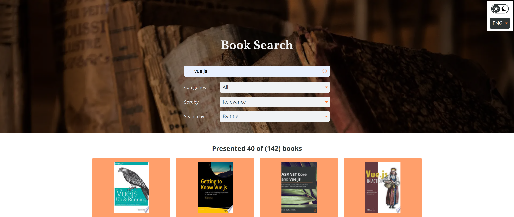
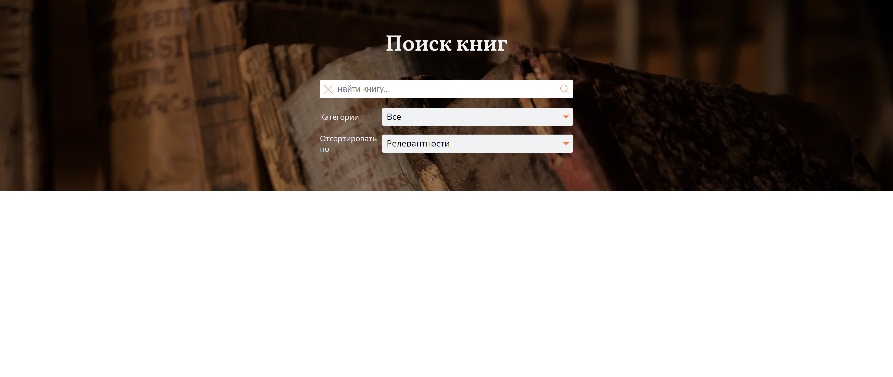

# 📖 Приложение по поиску книг
[Cсылка на демо](https://eduardvorsin.github.io/future-react-app/)





## Технологии которые использовались при написании


## 📄 Описание проекта
Веб приложение по поиску книг.

Данное приложение состоит из поиска, фильтров для поиска, списка найденных книг и отдельных страниц с описанием каждой книги.

В карточке каждой книги отображается обложка книги, цена, заголовок, авторы и кнопка "подробнее"

На странице конкретной книги представлено:
- Текущая цена и кнопка "купить"
- Кнопка "читать фрагмент книги" которая позволяет ознакомиться с содержимым книги через Google Books
- Обложка книги
- Ее характеристики такие как количество страниц, возрастной рейтинг, авторы, издатель ISBN, и т.д.
- А также описание самой книги 

Если книга подходит под категорию 18+ то обложка книги у карточки становиться размытой и добавляется соответствующая маркировка.

Данные о книгах загружаются из Google Book API

## 🛠️Как запустить проект
1. Клонировать это репозиторий с помощью команды:

`git clone https://github.com/eduardvorsin/future-react-app.git`

2. Установить нужные зависимости используя следующую команду
```
$ npm i
```
3. Запустить приложение

Для запуска в режиме разработки
```
$ npm start
```
Для сборки build версии проекта
```
$ npm run build
```

## ✨ Особенности
- Возможность сортировки книг по релевантности и категориям
- Возможность посмотреть фрагмент книги и купить ее через Google Books
- Возможность подгрузки книг которые соответствуют введенному запросу через кнопку "cмотреть еще"
- Возможность переключения темы приложения с темной на светлую
